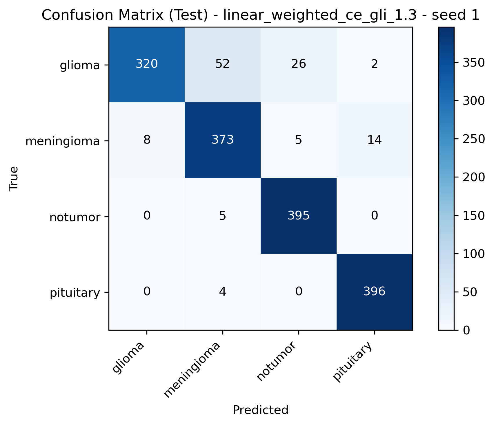

# 基于 PyTorch 的脑肿瘤 MRI 分类项目

这是一个基于 **PyTorch** 的医学图像分类项目，使用预训练 **ResNet50** 骨干网络，通过迁移学习完成 **4 类脑肿瘤 MRI 图像分类**。

本项目不仅包含基础分类流程，还包括：

- 模块化训练与评估代码
- 多随机种子实验
- 不同分类头 / 损失函数设计的比较
- 使用 **类别加权交叉熵（class-weighted cross-entropy）** 针对性提升 **glioma 召回率**

---

## 任务简介

将脑部 MRI 图像分类为以下四类之一：

- glioma（胶质瘤）
- meningioma（脑膜瘤）
- notumor（无肿瘤）
- pituitary（垂体瘤）

---

## 方法

本项目对比了以下几种方法：

- **`linear`**  
  预训练 ResNet50 + 线性分类头

- **`deep_mlp`**  
  预训练 ResNet50 + 更深的 MLP 分类头

- **`linear_weighted_ce_gli_1.3`**  
  预训练 ResNet50 + 线性分类头 + 类别加权交叉熵  
  权重设置为：

```python
[1.3, 1.0, 1.0, 1.0]
```

该设置会在训练中对 **glioma** 类别给予轻微更高的损失权重。

---

## 结果概览

在 3 个随机种子上，类别加权交叉熵方法同时提升了 **平均测试准确率** 和 **glioma 召回率**，优于原始线性基线。

### 线性基线

| 方法 | Seed | 测试准确率 | Glioma 召回率 |
|---|---:|---:|---:|
| linear | 1 | 0.9238 | 0.77 |
| linear | 2 | 0.9056 | 0.76 |
| linear | 3 | 0.9344 | 0.81 |

**平均测试准确率：** 0.9213  
**平均 Glioma 召回率：** 0.7800

### 加权交叉熵改进方法

| 方法 | Seed | 测试准确率 | Glioma 召回率 |
|---|---:|---:|---:|
| linear_weighted_ce_gli_1.3 | 1 | 0.9275 | 0.80 |
| linear_weighted_ce_gli_1.3 | 2 | 0.9313 | 0.81 |
| linear_weighted_ce_gli_1.3 | 3 | 0.9381 | 0.83 |

**平均测试准确率：** 0.9323  
**平均 Glioma 召回率：** 0.8133

### 主要结论

与原始线性基线相比，类别加权交叉熵方法：

- 将平均测试准确率从 **0.9213** 提升到 **0.9323**
- 将平均 glioma 召回率从 **0.7800** 提升到 **0.8133**
- 在多个随机种子下表现更稳定

在当前实验设置下，该加权交叉熵版本是本项目测试过的 **最佳单模型方法**。

---

## 项目结构

```text
brain-tumor-mri-classification/
├── data/
├── models/
├── notebooks/
│   ├── demo.ipynb
│   └── compare_models.ipynb
├── outputs/
├── src/
│   ├── data.py
│   ├── model.py
│   ├── train_eval.py
│   └── inference.py
├── README.md
├── requirements.txt
└── .gitignore
```

---

## 流程说明

- 从按类别划分的文件夹中加载 MRI 图像
- 进行预处理与数据增强
- 微调预训练 ResNet50 模型
- 使用以下指标评估：
  - 测试准确率
  - 分类报告
  - 混淆矩阵
- 在多个随机种子下比较不同方法

训练采用 **两阶段策略**：

1. 先训练分类头
2. 再对骨干网络进行微调

---

## 数据集格式

```text
data/
├── Training/
│   ├── glioma/
│   ├── meningioma/
│   ├── notumor/
│   └── pituitary/
└── Testing/
    ├── glioma/
    ├── meningioma/
    ├── notumor/
    └── pituitary/
```

说明：

- 本仓库 **不包含完整数据集**
- 运行代码前，请先将数据集放入 `data/` 目录

---

## 运行方式

### 1. 安装依赖

```bash
pip install -r requirements.txt
```

### 2. 准备数据集

请将数据集放置为：

```text
data/Training
data/Testing
```

### 3. 运行主训练 Notebook

```text
notebooks/demo.ipynb
```

该 notebook 支持通过以下参数控制实验配置：

- `HEAD_TYPE`
- `CLASS_WEIGHTS`

程序会自动生成方法名称，并将结果保存到对应目录。

### 4. 比较已保存模型

```text
notebooks/compare_models.ipynb
```

该 notebook 会读取已保存的 checkpoint，并在多个 seed 下比较不同方法。

---

## 配置示例

### 纯线性基线

```python
HEAD_TYPE = "linear"
CLASS_WEIGHTS = [1, 1, 1, 1]
```

### 类别加权交叉熵版本

```python
HEAD_TYPE = "linear"
CLASS_WEIGHTS = [1.3, 1, 1, 1]
```

### Deep MLP 分类头

```python
HEAD_TYPE = "deep_mlp"
CLASS_WEIGHTS = [1, 1, 1, 1]
```

---

## 结果图示例

你可以在 GitHub 的 Markdown 中直接嵌入保存好的结果图，例如：

```markdown



```

---

## 项目价值

本项目体现了以下能力：

- 使用 PyTorch 构建完整图像分类流程
- 迁移学习与分阶段微调
- 模块化机器学习代码组织
- 多随机种子实验评估
- 通过损失重加权实现针对性性能提升
- 模型比较与实验结果分析

---

## 后续可扩展方向

可进一步尝试：

- 前景裁剪 / 去黑边
- 测试时增强（TTA）
- 多 seed 集成
- 更进一步的类别权重调优
